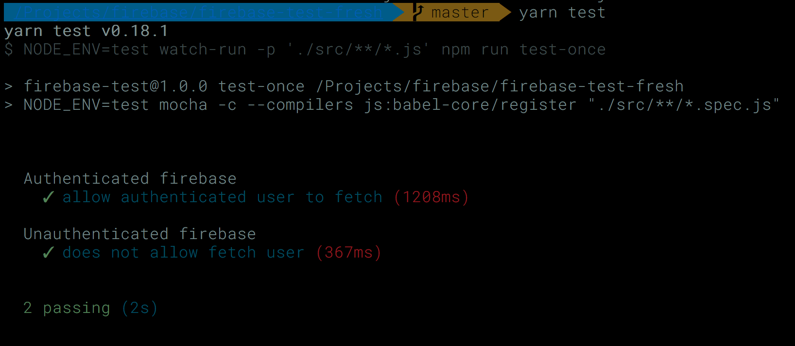

# Firebase Unit Test

Demonstrate how to perform automated unit tests against database and rules

# Prerequisite 

#### install node

#### install yarn package manager

https://yarnpkg.com/en/docs/install

#### install firebase-tools globally

```
yarn global add firebase-tools
```


# Installation

## Clone and init the repo 

```
git clone https://github.com/zirho/firebase-test
cd firebase-test
yarn install
```

## Create and init firebase app

**Skip this if you already have a project setup and initiated**

#### Create a project

Go to https://console.firebase.google.com/project/

Create a new project

#### Get project configs

Update firebase.config.js with what your project gave you

```
vi src/firebase.config.js
```

It should look something like this
```
export default {
  apiKey: 'your-app-key',
  authDomain: 'your-app-domain.firebaseapp.io',
  databaseURL: 'https://your-firebase-database-url.firebaseio.com',
}
```

#### Init the project 

* refrence https://github.com/firebase/firebase-tools
```
firebase login
firebase init
```

Follow the instructions
 * select database
 * select project name that you created
 * select default for other options

#### Get an admin credential file

 * Go to "Project Setting" on firebase console.
 * Select "SERVICE ACCOUNTS" tab
 * Click on "GENERATE NEW PRIVATE KEY" at the bottom
 * It will download a creds json file
 * Copy that file to root folder of your project and rename it as 'firebase-admin.json'

 For Mac user

 ```
 cp ~/Downloads/[downloaded file name].json ./firebase-admin.json
 ```

#### Apply new rules for firebase database

Update `./database.rules.json` as you needed

And deploy it
```
firebase deploy --only database
```

## Run tests

#### Run test once

```
yarn test-once
```

#### Run tests any time *.js file updates (watch and run tests)

```
yarn test
```

#### Run tests as an authenticated user

Pick a UID from firebase console > Authenticateion > USERS 

Put the UID to the test

```
vi src/auth.test.js
```
```
describe('Authenticated firebase', () => {
  let authedFirebase
  const UID = 'vl7GjxgIRre1sD0ftesttesttesttest'
...
...
```

#### Default tests will be successful, if your database has `/user/joshua` available





**Welcome to contribute**

